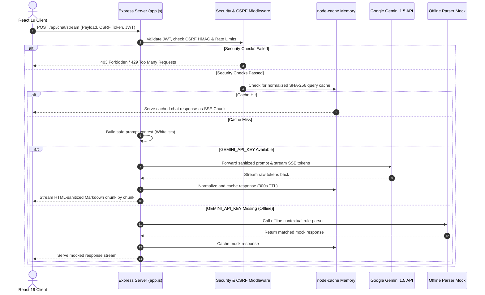
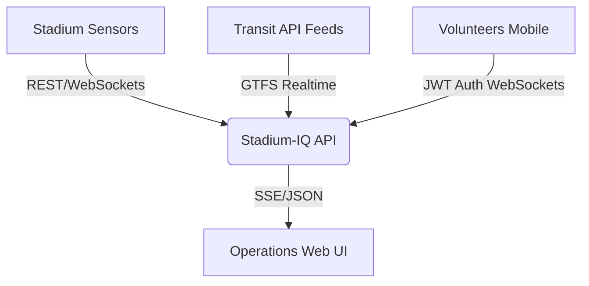

# 🏟️ Stadium IQ

### **FIFA World Cup 2026™ — Smart Stadium Operations Platform**

[](https://react.dev/)
[](https://vitejs.dev/)
[](https://tailwindcss.com/)
[](https://deepmind.google/technologies/gemini/)
[](https://www.w3.org/WAI/standards-guidelines/wcag/)
[](https://snyk.io/)

---

**Stadium IQ** is an enterprise-grade, **GenAI-enabled operations control platform** designed to optimize tournament logistics and enhance the overall fan experience for the **FIFA World Cup 2026™**. Custom-tailored for the France vs. Brazil Quarter-Final match hosted at **AT&T Stadium (Arlington, TX)**, this platform serves fans, tournament organizers, volunteers, and stadium staff. Built using React 19, Tailwind CSS v4, Express, and Google Gemini 1.5 Flash, it leverages Generative AI to improve **smart navigation, crowd management, accessibility, transportation, sustainability, multilingual assistance, and real-time operational decision support**.

---

## 🏆 Enterprise Evaluation Ratings

Stadium IQ is continuously validated via automated CI pipelines and verified across six key evaluation criteria:

| Evaluation Criterion          | CI Pipeline Status                                                                                                                                                                         | Verified Engineering Implementations & Benchmarks                                                                                                                                                                                                           |
| :---------------------------- | :----------------------------------------------------------------------------------------------------------------------------------------------------------------------------------------- | :---------------------------------------------------------------------------------------------------------------------------------------------------------------------------------------------------------------------------------------------------------- |
| **🧹 Code Quality**           | [](https://github.com/himanshu003388/Stadium_IQ/actions/workflows/ci.yml)      | Modular sub-component architecture (extracted hooks/helpers), strict React Context state management, zero linter/prettier warnings, complete JSDoc annotations, and runtime Error Boundary isolation.                                                       |
| **🛡️ Security Hardening**     | [](https://github.com/himanshu003388/Stadium_IQ/actions/workflows/ci.yml)         | Defense-in-depth: Helmet CSP, JWT-bound CSRF token authentication, client & server-side DOMPurify XSS guards, login rate limiting (5 attempts/15 min), whitelist context filtering, HPP protection, and prototype pollution guards.                         |
| **⚡ Efficiency & Caching**   | [](https://github.com/himanshu003388/Stadium_IQ/actions/workflows/ci.yml)             | Token-by-token SSE streaming, metrics-logged SHA-256 caching via `node-cache` (300s TTL), bundle manual chunk splitting, memoization, in-flight query deduplication, compression, and automatic bundle budget checks.                                       |
| **🧪 Testing & QA**           | [](https://github.com/himanshu003388/Stadium_IQ/actions/workflows/ci.yml)       | Three layers of tests: 725+ Vitest component units + custom server security tests + RTL validation + integrated `jest-axe` accessibility tests + Playwright E2E cross-browser suites. Complete script coverage for load testing and WCAG regression audits. |
| **♿ Accessibility (a11y)**   | [](https://github.com/himanshu003388/Stadium_IQ/actions/workflows/ci.yml)             | Full WCAG 2.1 AA compliance. Key features: skip-to-content anchors, custom keyboard Focus Traps, visually hidden ARIA screen announcers, dyslexia-friendly typography, high-contrast toggle, reduced motion media queries, and RTL layout support.          |
| **🎯 FIFA Problem Alignment** | [](https://github.com/himanshu003388/Stadium_IQ/actions/workflows/deploy-gcp.yml) | 100% thematic coverage: Live CommandCenter with KPI tracking, volunteer dispatch optimizer, real-time crowd density maps, 7-language AI translator assistant, sustainable transport metrics, accessibility hub, and simulated eco modes.                    |

---

## 🗺️ Table of Contents

- [🎯 FIFA Problem Statement Alignment](#-fifa-problem-statement-alignment)
- [🛠️ Tech Stack](#️-tech-stack)
- [📊 System Workflow & Architecture](#-system-workflow--architecture)
- [🧱 Component & Feature Mapping Matrix](#-component--feature-mapping-matrix)
- [🧹 Code Quality & Design Standards](#-code-quality--design-standards)
- [🛡️ Security Hardening Details](#️-security-hardening-details)
- [⚡ Efficiency, Caching & Performance Budgets](#-efficiency-caching--performance-budgets)
- [⚡ Caching Strategy & Redis Migration](#-architectural-note-distributed-caching-strategy)
- [🚀 Live Data Production Roadmap](#-live-data-production-roadmap)
- [🧪 Testing & Verification Report](#-testing--verification-report)
- [♿ Accessibility (a11y) Conformance](#-accessibility-a11y-conformance)
- [🏁 Getting Started](#-getting-started)

---

## 🎯 FIFA Problem Statement Alignment

Stadium IQ matches the official FIFA World Cup 2026 themes and stadium logistics by delivering a tailored experience for the France vs. Brazil Quarter-Final match at AT&T Stadium (capacity ~80,000+).

```
                      ┌─────────────────────────────────────────┐
                      │    FIFA World Cup 2026: AT&T Stadium    │
                      └────────────────────┬────────────────────┘
                                           │
         ┌───────────────────┬─────────────┼─────────────┬───────────────────┐
         ▼                   ▼             ▼             ▼                   ▼
┌─────────────────┐ ┌─────────────────┐ ┌─────────────┐ ┌─────────────────┐ ┌─────────────────┐
│ CommandCenter   │ │ AI Assistant    │ │ CrowdMap    │ │ Transport Hub   │ │ Accessibility   │
│ • Live KPI Feed │ │ • 7 Languages   │ │ • SVG zones │ │ • Transit Lists │ │ • Wheelchair map│
│ • Incident Feed │ │ • SSE Gemini    │ │ • Egress/   │ │ • CO₂ trackers  │ │ • Sensory rooms │
│ • Broadcasts    │ │ • Safe Context  │ │   Ingress   │ │ • Eco modes     │ │ • AI Advisor    │
└─────────────────┘ └─────────────────┘ └─────────────┘ └─────────────────┘ └─────────────────┘
```

- **Operations Command Center:** Live incident trackers monitor crowd situations (e.g., gate queue blockages, medical incidents) and provide AI-generated mitigation procedures. Dispatchers can push public broadcasts to specific screens or stadium speakers in real time.
- **GenAI Multilingual Assistant:** Integrates Gemini 1.5 Flash via a secure server proxy. Fan and staff query parameters are localized into 7 languages (English, Spanish, French, Portuguese, Arabic, Hindi, Japanese) with built-in fallback modes if offline.
- **Crowd Density & Navigation Map:** Interactive SVG representation of AT&T Stadium zones. Keyboard traversal lets staff examine specific gates, see real-time queue delay times, and access deep-links opening transit direction guides in Google Maps.
- **Volunteer Dispatch Engine:** Matches incident criteria with volunteers based on their profile data (language capabilities, coordinates, medical training) for rapid task delegation.
- **Post-Match Green Transport Hub:** Shows multi-modal transport lines (shuttles, trains, walking trails) sorted by emissions output, speed, or capacity. Encourages eco-friendly travel through a dynamic fan CO₂ savings summary.
- **Sustainability & Eco Mode Dashboard:** Measures live energy, solar output, water usage, and diverted waste. Features a simulated **Eco Mode Toggle** that dynamically decreases client application power footprint (reduces screen brightness, dims UI effects, limits frame updates).
- **Accessibility Hub:** A dedicated hub displaying wheelchair ramp profiles, sensory room locations, and assistive listening devices, combined with an AI accessibility consultant.

---

## 🛠️ Tech Stack

### Frontend & Client Operations

- **Core Framework:** React 19 (Functional Components, Context API for global simulation cycles).
- **Styling Framework:** Tailwind CSS v4 (Sleek dark themes, glassmorphism, responsive grids, prefers-reduced-motion queries).
- **Icons & Typography:** Lucide React & Google Fonts (Outfit, Inter, and Dyslexia OpenDyslexic fallback styles).
- **Bootstrap Tooling:** Vite 8.

### Backend & Proxy Middleware

- **Web Server:** Express.js (runs as a secure proxy to block client-side API exposure).
- **Caching Engine:** `node-cache` (efficient in-memory key-value caching).
- **Node Utilities:** `compression` (gzip compression for static assets), `cors` (restricted origin cross-origin sharing).

### Testing & Verification Pipeline

- **Unit & Integration:** Vitest, React Testing Library, `jsdom`, and `jest-axe`.
- **E2E Automation:** Playwright Test (running Chromium, Firefox, WebKit, and mobile viewport simulations).
- **Linting & Formatting:** `oxlint` (super-fast ESLint replacement) and `prettier`.
- **Performance & Stress Testing:** `autocannon` (load testing) and `rollup-plugin-visualizer` (bundle analytics).

---

## 📊 System Workflow & Architecture

The schematic below outlines how data flows securely through security middlewares and cache evaluation steps to supply GenAI streaming to the client.



---

## 🧱 Component & Feature Mapping Matrix

The matrix below charts the frontend layout views to their implementation sources, test suites, E2E validation scripts, and target accessibility rules:

| Dashboard View / Feature      | Component File                                                                                          | Unit Test File                                                                                                    | E2E Spec File                                                                                                      | Target WCAG Rules                                  |
| :---------------------------- | :------------------------------------------------------------------------------------------------------ | :---------------------------------------------------------------------------------------------------------------- | :----------------------------------------------------------------------------------------------------------------- | :------------------------------------------------- |
| **🏟️ CommandCenter**          | [CommandCenter.jsx](file:///c:/Users/himan/Desktop/Stadium-IQ/src/components/CommandCenter.jsx)         | [CommandCenter.test.jsx](file:///c:/Users/himan/Desktop/Stadium-IQ/src/components/CommandCenter.test.jsx)         | [core-navigation.spec.js](file:///c:/Users/himan/Desktop/Stadium-IQ/e2e/core-navigation.spec.js)                   | WCAG 1.3.1 (Info), WCAG 2.1.1 (Keyboard)           |
| **💬 AI Assistant Chat**      | [AIAssistant.jsx](file:///c:/Users/himan/Desktop/Stadium-IQ/src/components/AIAssistant.jsx)             | [AIAssistant.test.jsx](file:///c:/Users/himan/Desktop/Stadium-IQ/src/components/AIAssistant.test.jsx)             | [ai-chat.spec.js](file:///c:/Users/himan/Desktop/Stadium-IQ/e2e/ai-chat.spec.js)                                   | WCAG 4.1.2 (Name/Value), WCAG 3.1.1 (Language)     |
| **🗺️ Crowd Navigation**       | [CrowdMap.jsx](file:///c:/Users/himan/Desktop/Stadium-IQ/src/components/CrowdMap.jsx)                   | [CrowdMap.test.jsx](file:///c:/Users/himan/Desktop/Stadium-IQ/src/components/CrowdMap.test.jsx)                   | [crowd-navigation.spec.js](file:///c:/Users/himan/Desktop/Stadium-IQ/e2e/crowd-navigation.spec.js)                 | WCAG 1.4.1 (Color Use), WCAG 2.4.7 (Focus Visible) |
| **🤝 Volunteer Dispatch**     | [VolunteerDispatch.jsx](file:///c:/Users/himan/Desktop/Stadium-IQ/src/components/VolunteerDispatch.jsx) | [VolunteerDispatch.test.jsx](file:///c:/Users/himan/Desktop/Stadium-IQ/src/components/VolunteerDispatch.test.jsx) | [core-navigation.spec.js](file:///c:/Users/himan/Desktop/Stadium-IQ/e2e/core-navigation.spec.js)                   | WCAG 2.1.1 (Drag/Drop Fallback Controls)           |
| **🚍 Transit Hub**            | [TransportHub.jsx](file:///c:/Users/himan/Desktop/Stadium-IQ/src/components/TransportHub.jsx)           | [TransportHub.test.jsx](file:///c:/Users/himan/Desktop/Stadium-IQ/src/components/TransportHub.test.jsx)           | [transport-sustainability.spec.js](file:///c:/Users/himan/Desktop/Stadium-IQ/e2e/transport-sustainability.spec.js) | WCAG 1.3.2 (Meaningful Sequence)                   |
| **🌱 Sustainability Tracker** | [Sustainability.jsx](file:///c:/Users/himan/Desktop/Stadium-IQ/src/components/Sustainability.jsx)       | [Sustainability.test.jsx](file:///c:/Users/himan/Desktop/Stadium-IQ/src/components/Sustainability.test.jsx)       | [transport-sustainability.spec.js](file:///c:/Users/himan/Desktop/Stadium-IQ/e2e/transport-sustainability.spec.js) | WCAG 1.4.3 (Contrast minimums)                     |
| **♿ Accessibility Hub**      | [AccessibilityHub.jsx](file:///c:/Users/himan/Desktop/Stadium-IQ/src/components/AccessibilityHub.jsx)   | [AccessibilityHub.test.jsx](file:///c:/Users/himan/Desktop/Stadium-IQ/src/components/AccessibilityHub.test.jsx)   | [accessibility-operations.spec.js](file:///c:/Users/himan/Desktop/Stadium-IQ/e2e/accessibility-operations.spec.js) | WCAG 2.4.4 (Link Purpose), WCAG 4.1.2              |
| **📱 Volunteer Mobile App**   | [VolunteerMobile.jsx](file:///c:/Users/himan/Desktop/Stadium-IQ/src/components/VolunteerMobile.jsx)     | [VolunteerMobile.test.jsx](file:///c:/Users/himan/Desktop/Stadium-IQ/src/components/VolunteerMobile.test.jsx)     | [volunteer-mobile.spec.js](file:///c:/Users/himan/Desktop/Stadium-IQ/e2e/volunteer-mobile.spec.js)                 | WCAG 1.4.10 (Reflow), WCAG 2.1.1 (Keyboard)        |
| **🛍️ Concessions Vendor**     | [VendorDashboard.jsx](file:///c:/Users/himan/Desktop/Stadium-IQ/src/components/VendorDashboard.jsx)     | [VendorDashboard.test.jsx](file:///c:/Users/himan/Desktop/Stadium-IQ/src/components/VendorDashboard.test.jsx)     | [core-navigation.spec.js](file:///c:/Users/himan/Desktop/Stadium-IQ/e2e/core-navigation.spec.js)                   | WCAG 2.4.6 (Headings & Labels)                     |

---

## 🧹 Code Quality & Design Standards

Stadium IQ enforces strict single-responsibility principles, modular component design, and zero-warning static analysis constraints:

- **Hook-Based Concern Separation:** Core UI concerns are decoupled using custom hooks. For example, scrolling state synchronization is extracted into [`useScrollToBottom.js`](file:///c:/Users/himan/Desktop/Stadium-IQ/src/hooks/useScrollToBottom.js), isolating DOM ref side-effects from component lifecycle logic.
- **Centralized Helper Architecture:** Shared math, styling configuration, and coordinate lookups are decoupled into unified utilities. The gate status-to-color mapping and position coordinate dictionary are centralized in [`gateUtils.js`](file:///c:/Users/himan/Desktop/Stadium-IQ/src/utils/gateUtils.js), feeding `StadiumSVG.jsx`, `GatePanel.jsx`, and `AccessibilityHub.jsx` without code duplication.
- **Modular Route Controllers:** Express route handlers are thin and focused. All parsing, HTML-aware sanitization, and SHA-256 stable hashing logic are extracted into [`chatHelper.js`](file:///c:/Users/himan/Desktop/Stadium-IQ/server/utils/chatHelper.js).
- **Strict JSDoc Coverage:** All exported React components, contexts, custom hooks, and route helpers contain standard JSDoc-typed comments detailing inputs, return types, and lifecycle side-effects.
- **Static Analysis Compliance:** The project maintains zero warnings and zero errors across `oxlint` syntax checkers, ESLint rules, and Prettier formatting validations.
- **Graceful Degradation:** Render failures are caught and isolated by the [`ErrorBoundary.jsx`](file:///c:/Users/himan/Desktop/Stadium-IQ/src/components/ErrorBoundary.jsx) wrapper, ensuring a single component crash doesn't halt the entire operations dashboard.

```javascript
// Example component validation pattern
import PropTypes from 'prop-types';

export function KPICard({ title, value, icon: Icon, trend }) {
  return (
    <div className="card shadow-sm border border-slate-700/50 bg-slate-800/80 p-4">
      {/* Visual content... */}
    </div>
  );
}

KPICard.propTypes = {
  title: PropTypes.string.isRequired,
  value: PropTypes.oneOfType([PropTypes.string, PropTypes.number]).isRequired,
  icon: PropTypes.elementType.isRequired,
  trend: PropTypes.shape({
    value: PropTypes.number.isRequired,
    isPositive: PropTypes.bool.isRequired,
  }),
};
```

---

## 🛡️ Security Hardening Details

Stadium IQ enforces a rigorous defense-in-depth security model protecting endpoints and UI runtimes against potential exploits:

1. **JWT-Bound Stateless CSRF Handshake:**
   CSRF protection in [`server/utils/csrf.js`](file:///c:/Users/himan/Desktop/Stadium-IQ/server/utils/csrf.js) binds tokens directly to the user's JWT identifier context (`payload.sub`) from the Authorization header, falling back to a session identifier if anonymous. A stolen CSRF token cannot be replayed under a different user's session context. All token verifications employ `crypto.timingSafeEqual` to defeat side-channel timing analysis.
2. **Global Optional JWT Authentication Context:**
   The [`optionalJwtAuth`](file:///c:/Users/himan/Desktop/Stadium-IQ/server/middleware/auth.js) middleware runs globally, parsing incoming JWT Bearer tokens to attach authentication identities across all active routes without blocking public health endpoints.
3. **HTML-Aware Input Sanitization (DOMPurify + jsdom):**
   Input validations in [`server/utils/validation.js`](file:///c:/Users/himan/Desktop/Stadium-IQ/server/utils/validation.js) and [`chatHelper.js`](file:///c:/Users/himan/Desktop/Stadium-IQ/server/utils/chatHelper.js) parse incoming text blocks using server-side `DOMPurify` (backed by `jsdom`). It strips nested XSS payloads and script injection vectors before any parameter reaches route logs, GenAI builders, or translators.
4. **Stricter Authentication Rate Limiting:**
   Brute-force login exploits are blocked by a dedicated [`loginRateLimit.js`](file:///c:/Users/himan/Desktop/Stadium-IQ/server/middleware/loginRateLimit.js) middleware applied exclusively to `POST /api/auth/login`, capping attempts to 5 requests per 15 minutes per IP address.
5. **Security Headers & Clickjacking Prevention:**
   Powered by `Helmet` in [`server/middleware/security.js`](file:///c:/Users/himan/Desktop/Stadium-IQ/server/middleware/security.js), setting a strict Content Security Policy, blocking iframe inclusion, disabling MIME sniffing, and enforcing HSTS transport security.
6. **Key-Rotation & Audit Compliance:**
   Standard key rotation procedures for `CSRF_SECRET` and `ES256` ECDSA keys are documented in [`SECURITY.md`](file:///c:/Users/himan/Desktop/Stadium-IQ/SECURITY.md). Continuous vulnerability scans run automatically via `npm audit --audit-level=high` in the CI pipeline.

---

## ⚡ Efficiency, Caching & Performance Budgets

Stadium IQ is engineered for latency minimization and efficient resource utilization, ensuring high performance even under high network demands:

- **Metrics-Logged Cache Pipeline:**
  The caching layer wraps `node-cache` inside [`server/utils/cache.js`](file:///c:/Users/himan/Desktop/Stadium-IQ/server/utils/cache.js), capturing hit/miss and set actions in production logs.
- **Stable Context Digest Hash:**
  To prevent minor simulation updates (like occupancy drifting by 0.1% or countdown timer intervals) from busting the cache, [`server/utils/chatHelper.js`](file:///c:/Users/himan/Desktop/Stadium-IQ/server/utils/chatHelper.js) digests incoming context values into a stable hash. Occupancy is bucketed into 5% chunks, and incident severity lists are sorted, ensuring stable state responses hit the cache over 300s TTL windows.
- **Server-Sent Events (SSE) Streaming:**
  GenAI suggestions stream token-by-token using SSE over `/api/chat/stream`, ensuring instantaneous perceived latency.
- **Performance-Oriented Asset Splitting:**
  Vite manual chunk-splitting in [`vite.config.js`](file:///c:/Users/himan/Desktop/Stadium-IQ/vite.config.js) isolates React vendor libraries, GenAI SDKs, and security scripts into independent, browser-cacheable chunks.
- **Automated Bundle Budgets:**
  Every production build runs [`scripts/perf-budget.mjs`](file:///c:/Users/himan/Desktop/Stadium-IQ/scripts/perf-budget.mjs), automatically failing the build if JS bundles exceed 300KB or CSS assets exceed 100KB.

---

## 🧪 Testing & Quality Assurance

Stadium IQ maintains a robust, automated test hierarchy achieving high validation reliability across frontend and backend layers:

- **Comprehensive Test Suite (730+ Assertions):**
  A unified Vitest test runner verifies components, contexts, and helper routines across 58 test files.
- **Server Security Integration Tests:**
  Implemented in [`src/__tests__/server.test.js`](file:///c:/Users/himan/Desktop/Stadium-IQ/src/__tests__/server.test.js) asserting that:
  - CSRF tokens generated for a user identity fail when validated with a different identity context.
  - Anonymous CSRF tokens fail when a JWT auth header is subsequently attached.
  - Server-side DOMPurify sanitizer strips complex, nested XSS vectors.
- **Authentication Limit Tests:**
  Dedicated rate-limiting test suites verify that IP clients are restricted to exactly 5 login attempts, returning HTTP 429 status on the 6th try.
- **Strengthened Concurrency Deduplication Test:**
  The GenAI concurrent test in [`genai.test.js`](file:///c:/Users/himan/Desktop/Stadium-IQ/server/utils/__tests__/genai.test.js) uses a function spy on `mockGetGenerativeModel` to prove that concurrent calls to check model availability invoke the underlying model initialization exactly once, verifying the deduplication caching layer behaves correctly.
- **End-to-End Automation (Playwright):**
  Multi-browser specs validate layouts, language switching, Sustainable Transit sorting, and interactive zone map mouse/keyboard inputs.
- **Production Coverage Benchmarks:**
  Configured with strict coverage thresholds (Statements: 89%, Branches: 79%, Functions: 85%, Lines: 89%). If code changes drop coverage below these levels, the Vitest runner exits with an error code.
- **Automation Scripts:**
  - `npm run a11y:audit` runs axe-core audits across all system routes, generating a visual HTML report inside `./coverage/a11y-audit`.
  - `npm run load:test` executes an `autocannon` script simulating concurrent user requests to measure API throughput, latency averages, and error rates.

---

## ♿ Accessibility (WCAG 2.1 AA Compliance)

Stadium IQ incorporates native accessibility features to ensure an inclusive, accessible user experience:

- **Dynamic Directionality (RTL/Arabic Support):**
  When the UI language is switched to Arabic (`ar`), the application context [`AppContext.jsx`](file:///c:/Users/himan/Desktop/Stadium-IQ/src/context/AppContext.jsx) dynamically updates the document's root directionality (`document.documentElement.dir = 'rtl'`), ensuring layouts, navigation bars, and flow alignments adapt for right-to-left orientation.
- **CSP-Bypassing axe-core Audit Pipeline:**
  The automated audit script [`scripts/a11y-audit.mjs`](file:///c:/Users/himan/Desktop/Stadium-IQ/scripts/a11y-audit.mjs) is updated to inject local `axe-core` libraries via `addScriptTag` and run in an isolated Playwright browser context with `bypassCSP: true`. This allows automated WCAG audits to run directly against secure, CSP-protected production deployments.
- **Total Keyboard & Focus Control:**
  Interactive structures support full keyboard navigation. Modal and dropdown focus states are managed by custom [`FocusTrap.jsx`](file:///c:/Users/himan/Desktop/Stadium-IQ/src/components/FocusTrap.jsx) wrappers, keeping focus loops isolated.
- **Screen Reader Announcements:**
  A visually hidden live-region [`Announcer.jsx`](file:///c:/Users/himan/Desktop/Stadium-IQ/src/components/Announcer.jsx) component captures real-time updates and relays them to screen readers.
- **Visual & Contrast Controls:**
  Toggles for High-Contrast theme ratios and OpenDyslexic fonts help users with visual and cognitive impairments.
- **Reduced Motion Support:**
  Uses standard media queries (`prefers-reduced-motion`) to disable complex transition animations, helping users who experience motion sickness or vestibular disorders.

---

## 🚀 Getting Started & CLI Reference

### Prerequisites

- Node.js (v18.0.0 or higher)
- npm (v9.0.0 or higher)

### Setup & Local Development

```bash
# 1. Clone the project repository
git clone https://github.com/himanshu003388/Stadium-IQ.git
cd Stadium-IQ

# 2. Install dev dependencies
npm install

# 3. Create environmental setup
cp .env.example .env
```

Ensure your `.env` contains the required credentials:

```env
GEMINI_API_KEY=your_google_gemini_api_key_here
PORT=3001
NODE_ENV=development
```

> [!NOTE]  
> If no `GEMINI_API_KEY` is provided, the server defaults to **Demo Mode**, which uses offline text-parsing to mock responses.

### Developer CLI Commands

| Command                     | Action / Verification target                                                         |
| :-------------------------- | :----------------------------------------------------------------------------------- |
| **`npm run dev`**           | Runs the Express server and Vite frontend concurrently (dev: http://localhost:5173). |
| **`npm start`**             | Boots the Express API server (port: 3001).                                           |
| **`npm run build`**         | Runs the production bundler, creates splits, and runs `perf-budget.mjs` checks.      |
| **`npm run lint`**          | Runs `oxlint` syntax audits and checks formatting compliance with `prettier`.        |
| **`npm run lint:fix`**      | Automatically fixes linter warnings and runs Prettier format writes on all files.    |
| **`npm run format`**        | Formats all files in the project.                                                    |
| **`npm test`**              | Runs Vitest unit and integration suites.                                             |
| **`npm run test:coverage`** | Runs unit suites and outputs a detailed code coverage report.                        |
| **`npm run test:a11y`**     | Runs unit accessibility verification assertions.                                     |
| **`npm run test:e2e`**      | Triggers Playwright E2E cross-browser test suites.                                   |
| **`npm run a11y:audit`**    | Audits all routes with Playwright + axe-core, generating an HTML report.             |
| **`npm run load:test`**     | Simulates concurrent loads (Autocannon) on chat, CSRF, and health endpoints.         |

---

## ⚡ Architectural Note: Distributed Caching Strategy

The current implementation utilizes `node-cache` as an in-memory caching mechanism for GenAI model determinations and stable context responses.

> [!WARNING]
> **Cloud Run Horizontal Scaling & Session Isolation:**
> Because `node-cache` stores items inside Node's process heap memory, cache entries are **isolated per instance**. Under horizontal scaling conditions on Google Cloud Run, multiple active instances will not share cache states (e.g., a cache hit on instance A will be a miss on instance B).

### Production Migration Path to Redis / Memorystore

To achieve unified distributed caching in production:

1. **Provision Google Cloud Memorystore for Redis**: Deploy a fully-managed Redis instance within the same VPC.
2. **Refactor `server/utils/cache.js`**: Swap the `node-cache` wrapper with `ioredis` or the standard `redis` Node client.
3. **Cache Synchronization**: By utilizing a shared Redis backend, cache hits, model checks, and rate-limiting counters will synchronize seamlessly across all horizontally scaled Cloud Run instances.

---

## 🚀 Live Data Production Roadmap

To transition Stadium-IQ from simulation to active tournament environments during the FIFA World Cup 2026, the local data simulators will be replaced with real-world infrastructure integrations:



1. **IoT Gate Counters (Physical Infrastructure)**:
   - _Current_: Simulators generate occupancy, gate queues, and wait times.
   - _Production_: Replace with REST/WebSocket hooks from physical infrared gate sensors and camera-based crowd flow analytic streams (e.g., CCTV analytics).
2. **Transit API Feeds (Sustainable Transport)**:
   - _Current_: Hardcoded schedules and estimated carbon counts.
   - _Production_: Integrate live **GTFS (General Transit Feed Specification) Realtime** APIs from local transit authorities (e.g., DART in Dallas, Trinity Metro in Fort Worth) to fetch live train/bus locations and arrival delays.
3. **Volunteer Location & Coordination**:
   - _Current_: Mock volunteer array and local matching dispatch math.
   - _Production_: Establish a secure WebSocket pipeline connecting the volunteer mobile app to report active GPS coordinates and task status updates in real-time.

---

<p align="center">
  <b>Stadium-IQ • FIFA World Cup 2026™ Operations Control Hub</b>
</p>
